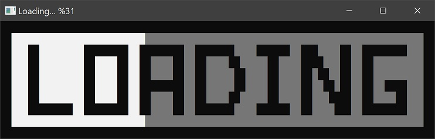
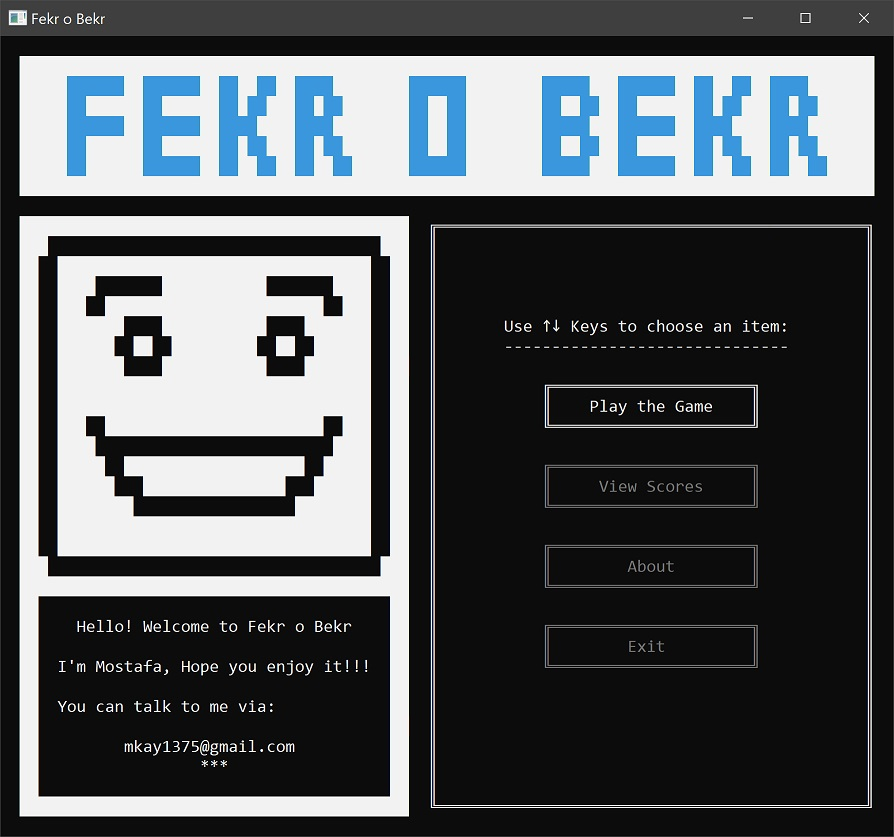
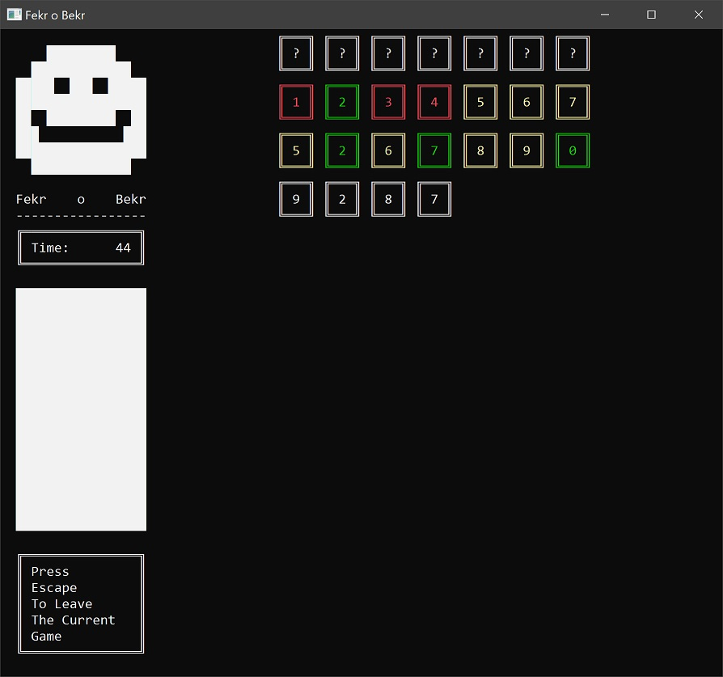

# Fekr O Bekr

A very simple game which you should guess the number;
red digits don't exist in the number, and the place of
yellow digits are wrong.

This exercise project was my final project in 
the first semester of university for basic programming
course.

The project was created using [Dev-C++](https://github.com/Embarcadero/Dev-Cpp)
and was written in C language but used some C++ standard libraries.

You can download the executable from releases page.

## Screenshots

